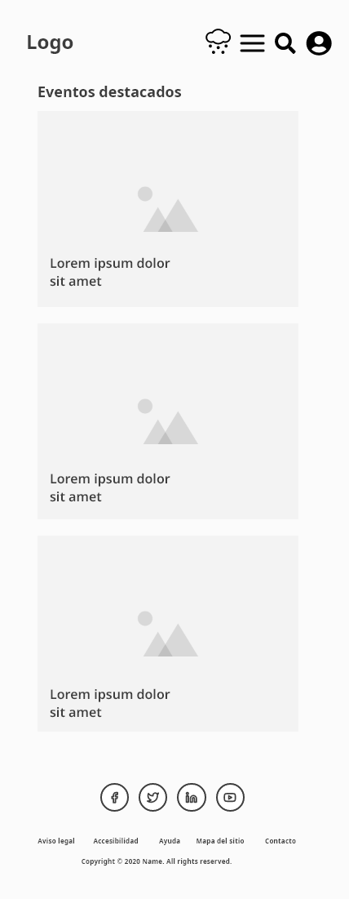

# Trabajo Final DIU21

### Autor: Sergio García Cabrera :wave:

## Parte 1: Mi experiencia UX

Durante esta asignatura, he obtenido una serie de conocimientos gracias a la realización de diversas tareas como la realización de un análisis etnográfico, que me ha permitido entender más en profundidad ciertos problemas de diseño o incluso identificar problemas de diseño completamente inesperados gracias a la observación de los participantes en un entorno de su vida real. Considero que la aplicación de este tipo de análisis es de suma importancia ya que ofrece al diseñador una visión de como realmente el usuario está usando su producto más allá de como él ha pensado que ha de ser usado.

 También he realizado un análisis de usabilidad web que me ha permitido aprender una serie de pautas y aspectos a tener en cuenta como el wayfinding o el responsive design para calificar la usabilidad de un sitio web de forma heurística, y gracias a la realización de un análisis de accesibilidad he podido no solo aprender sobre las pautas WCAG sino que también ser algo más empático hacia los usuarios que presentan algún tipo de discapacidad, aprendiendo algo más sobre como puede ser su experiencia de navegación web y las dificultades a las que se enfrentan en el proceso gracias al uso de diversas extensiones del navegador como NoCoffee Visión Simulator. En definitiva, estos tres análisis me han descubierto la importancia de realizar diseños centrados en el usuario, ya que hasta el momento, solo tenía en cuenta mi percepción y entendimiento de los diseños que realizaba.

Pasando a las prácticas de la asignatura, gracias a estas he podido experimentar en primera persona como es realmente el proceso de diseño de un producto, de forma similar a como se realizó con el ejemplo de [MuseMap](https://blog.prototypr.io/musemap-street-art-app-ux-case-study-9bec6a99823b). Durante el proyecto de prácticas se han realizado multitud de tareas, de las cuales yo destacaría:

- UX Desk Research:
  - Análisis competitivo y Revisión de usabilidad: Permite dar a conocer las fortalezas y debilidades de tus competidores para así poder inspirarte en lo que estos han hecho bien y evitar lo que han hecho mal a la hora de diseñar tu producto. Este conocimiento resulta clave para el éxito de lo que estemos diseñando, ya que no tendría sentido lanzar un producto que venga a satisfacer unas necesidades ya satisfechas por otro producto ya existente o que directamente sea peor en comparación con sus competidores.
- UX Design:
  - Sitemap y Wireframes: A mi parecer, resulta esencial partir de una idea sobre como van a estar organizados y colocados los contenidos, antes de proceder al diseño final. Haber aprendido estos pasos hará que mis diseños futuros sean mucho más razonados, organizados y fáciles de navegar, además de acelerar el proceso de implementación gracias a conocer de antemano el diseño que se quiere utilizar. Para la realización de los wireframe se hizo uso de software como [Adobe Xd](https://www.adobe.com/products/xd.html). Haber aprendido a usar este programa me ha descubierto el mundo del prototipado y su importancia a la hora de conseguir fácilmente un diseño refinado, gracias a un proceso de iteración de prototipos a raíz de la comunicación entre usuarios y diseñadores.
- UX-Case Study: 
  - Guidelines: Aunque conocía de antemano la existencia del concepto de guidelines de diseño, nunca lo había puesto en práctica, pero tras hacerlo, he comprendido que el seguir unas pautas preestablecidas de diseño, ayuda enormemente a mantener una consistencia visual, mejorando así la experiencia del usuario y la accesibilidad, especialmente el aspecto de la necesidad de que un diseño sea predecible.
  - Moodboard: Casi tan importante como las guidelines es obtener inspiración para establecerlas y, un moodboard resulta una excelente herramienta para conseguirlo. A mi parecer, su principal punto fuerte es que de un vistazo, da una visión global de lo que va a ser un diseño, dando también, una idea de como casan distintos aspectos elegidos como paletas de colores, fuentes o logotipos. Además, con herramientas como [Milanote](https://milanote.com/), se fomenta el trabajo en equipo, la colaboración y la puesta en común de ideas, haciendo del Moodboard un paso aún más importante para la inspiración de diseños en equipo.
- Evaluación:
  - A/B Testing y SUS score: Volviendo al diseño centrado en el usuario, considero que hacer partícipe a este del proceso de diseño es de gran relevancia ya que al final, van a ser estos los que hagan uso del producto y, hemos aprendido que una de las formas más eficaces de conseguir su feedback es mediante la realización de un test A/B acompañado de un cuestionario SUS. La combinación de estos dos nos permite obtener de una forma muy rápida y sencilla la percepción subjetiva del usuario ante dos variaciones de diseño o usabilidad.

Por último, querría comentar algunas ocasiones para las que la aplicación de estos conocimientos me ha sido de gran utilidad en otras asignaturas, como por ejemplo para la realización del diseño de mi proyecto de web de promoción de eventos para la asignatura de Sistemas de Información Basados en Web, donde antes de comenzar con el diseño de mi web, realicé un simple wireframe para tener una idea de como estructurar el contenido de esta, lo cual me ayudó con la organización y a acelerar el proceso de diseño.

Otro ejemplo de uso práctico del conocimiento obtenido fuera de la asignatura de DIU fue el uso de las guidelines de "Material Design" de Google para la realización de una app móvil en flutter con temática Covid para la asignatura de Desarrollo Software, consiguiendo así, todas las ventajas que han sido mencionadas anteriormente con respecto al uso de guidelines de diseño.

## Parte 2: Caso de estudio. Web YUZIN

**Caso de estudio**: En la elaboración del caso de estudio final INDIVIDUAL tiene como objetivo evaluar tu capacidad de aplicación de las técnicas y metodologías de diseño centrado en usuario y UX a un caso real: el (re)diseño de la web para una empresas de divulgación de eventos culturales (donde partimos de un diseño ya existente) de Yuzin.

**Antecedentes**: Yuzin ha sido desde hace muchos años una revista (en formato físico) que promociona las actividades culturales de la ciudad que se editaba mes a mes. Apareció sobre 2003 la web https://yuzin.com que permitía descargar la revista en formato digital (versión de eventos de Granada y de Sevilla), [aquí](https://yuzin.com/wp-content/uploads/2021/06/YUZIN-GRANADA-junio-2021.pdf) podéis ver la versión digital de este mes. A partir del 2019/20 se pasó a una versión más completa denominada yuzin club cultural.
 En este cambio se ha hecho un rediseño y orientación de la web en la que la revista digital se queda en segundo plano.

### Introducción

Aunque la web de Yuzin ha pasado por un rediseño bastante reciente, una serie de problemas de usabilidad saltan a la vista al acceder a esta. Es por ello, que realizaremos un proceso de rediseño partiendo del diseño actual para tener en cuenta tanto los puntos fuertes como los débiles de la web, valorando durante el proceso el rediseño que esta sufrió.

Para esto, aplicaremos técnicas de UX Desk Research, análisis y UX Design previamente al rediseño de la web.

### Análisis de la competencia

Al igual que Yuzin, existen también otras webs dedicadas a la promoción de eventos culturales como ***La Revista de la Palma*** o ***El Giraldillo***. Utilizaremos estas dos webs para realizar un análisis competitivo que nos permita ver las funcionalidades que ofrecen unas y otras y tal vez descubrir así otras funcionalidades que la web de Yuzin podría implementar.

- **Yuzin**: Como se ha mencionado anteriormente, se trata de un club cultural que busca promover eventos y espacios culturales de la ciudad de Granada y Sevilla, permitiendo la compra de tickets para estos eventos dentro de la propia web y distribuyendo mensualmente una revista gratuita con toda la información cultural. Además, también busca ser un altavoz donde los miembros de la comunidad puedan escribir artículos de opinión culturales.
- **La Revista de la Palma**: Se trata de una revista de ocio y cultura destinada exclusivamente a la Palma de Gran Canaria. Al igual que la web de Yuzin, ofrecen un listado de eventos de ocio y cultura además de noticias de interés general de la ciudad. En este caso, no disponen de una revista como tal, sino que la web en sí es considerada la revista cultural.
- **El Giraldillo**: Se trata de una web de eventos de ocio y cultura destinada a Andalucía en general pero con algo más de hincapié en la provincia de Sevilla. Además del usual listado de eventos clasificado por tipos, dispone también de un blog con artículos de opinión y noticias, además de la posibilidad de comprar tickets dentro de la web como en Yuzin.

A continuación podemos observar los resultados del análisis competitivo:

En base a este análisis, podemos extraer una serie de conclusiones sobre la funcionalidad que se podría esperar en una web de este estilo para ayudarnos a considerar mejoras para la web de Yuzin. En primer lugar, vemos como la funcionalidad más básica que toda web de eventos debería de tener como el listado de eventos, el filtrado, la compra de tickets, etc. están presentes en la web de Yuzin. Es cuando hablamos de funcionalidad más opcional orientada a mejorar la experiencia de usuario que esta web muestra algunas deficiencias en comparación con sus competidores como:

- **Ausencia de una sección para noticias culturales**: Es comprensible suponer que alguien interesado en asistir a eventos culturales y de ocio, también podría estar interesado en recibir información sobre las últimas noticias culturales.
- **Ausencia de un calendario de eventos**: Una forma muy visual de mostrar los eventos disponibles es mediante un calendario que indique qué eventos se producen en qué días del mes. Podría ser una buena alternativa a mostrar simplemente el tradicional listado de eventos.
- **Ausencia de una sección de eventos**: Permitir a los usuarios comentar en las publicaciones de los eventos ayudaría tanto a los usuarios para saber qué eventos son más recomendables como a los organizadores para obtener feedback sobre el evento.
- **Ausencia de un widget meteorológico**: Un widget del tiempo podría ser de mucha utilidad para un usuario a la hora de elegir una fecha u otra para ir a un evento, ya que nadie desea que el mal tiempo estropee sus planes y se le ahorraría el esfuerzo al usuario de tener que obtener esa información meteorológica de una fuente externa.

### Persona

Para apreciar un posible ejemplo de uso de la web de Yuzin, emplearemos a una persona de nombre Alexander. Alexander es un profesor joven que disfruta estando rodeado de cultura y que comienza a buscar eventos culturales a los que asistir en verano. Para la realización de esta persona se ha utilizado el [toolkit](https://github.com/mgea/UX-DIU-Toolkit) proporcionado por los profesores de la asignatura.

#### Escenario de uso

Alexander desea informarse sobre las novedades en eventos culturales y sobre qué se va a realizar este verano, así que busca en google "Revista eventos culturales Sevilla" y llega a la web de Yuzin. Lo primero que siente al acceder es una sensación de dejadez al ver el banner principal de la web con el texto completamente desencajado y las imágenes que acompañan a los artículos de opinión también descolocadas, además de sentirse un poco mareado con el movimiento constante de dicho banner. Leyendo la web identifica el texto de "Descargar Revista" y accede a esta sección. Una vez dentro, observa que se le ofrecen opciones de la revista para Granada, Sevilla y Málaga. A Alexander al ver esto, le entra la curiosidad sobre qué eventos culturales habría en su Málaga natal así que intenta acceder a esta revista pero sin éxito, ya que el icono correspondiente no hace nada al pulsarlo así que Alexander se rinde y descarga algo molesto, la revista de Sevilla para percatarse de que la "revista mensual" de Sevilla lleva sin ser actualizada desde Noviembre de 2020. Alexander ya un tanto enfadado termina recurriendo entonces a consultar los eventos desde la sección de "Agenda Cultural", donde si consigue su objetivo.

#### Conclusión

La web presenta problemas en elementos principales de esta como en el banner animado de la página principal o el listado de artículos de opinión de esta página. También cabe destacar como lo que antes era el elemento principal de la web, la revista, ahora da la impresión de abandono al presentar opciones que ni siquiera están disponibles además de no actualizar las revistas.

### Usability Review

Se ha realizado un Usability Review siguiendo la [plantilla](http://www.uxforthemasses.com/usability-reviews/) proporcionada por los profesores de la asignatura y UX for the Masses, donde Yuzin ha conseguido una puntuación de 57 puntos sobre 100. Puede acceder al Usability review desde [aquí](./usability-review.pdf). Analizando estos resultados podemos deducir qué aspectos es necesario mejorar del diseño actual y cuales deberíamos de mantener para el rediseño.

La web de Yuzin ha destacado positivamente en aspectos como:

- El menú de navegación y sus elementos es fácil de encontrar, intuitivo y consistente, aunque podría hacérsele algunos cambios visuales para mejorar el contraste y el aspecto.
- El usuario puede volver siempre a la página de inicio fácilmente desde el lago.
- El lenguaje, la terminología y el tono son apropiados y fácilmente comprensibles para el Target de usuario.
- La ayuda en línea es concisa y fácil de entender.

Por desgracia, la web destaca negativamente en un gran número de aspectos con más peso:

- No se aporta ayuda con respecto al uso y la navegación de la web, solo ayuda de carácter general.
- No se muestra la ubicación actual en la web de ninguna forma más allá de la url.
- No hay un mapa del sitio.
- La barra de búsqueda para texto no funciona.
- No hay una sección de comentarios.
- Las acciones en la web no suelen presentar feedback.
- No se utilizan los campos de entrada apropiados para formularios, solo se utilizan campos de texto y listados de opciones predefinidas.
- Problemas de responsive design: El menú de navegación desaparece completamente sin ofrecer otra alternativa si el ancho de la ventana se reduce hasta un punto.

### Rediseño UX

#### Propuesta de valor

Con este rediseño buscaremos solventar los problemas que han sido mencionados anteriormente, centrándonos principalmente en dar una mejor imagen de la web (y por tanto, de la empresa) atajando fallos visuales considerables que presenta la página, descartando contrastes pobres como el de amarillo sobre blanco, mejorando el proceso de búsqueda de eventos, añadiendo una sección de comentarios y haciendo la web responsive usando frameworks como Bootstrap para que la experiencia en cualquier tipo de dispositivo sea correcta.

#### Sitemap

Antes de comenzar a diseñar los wireframe para la web, comenzaremos realizando el sitemap que se utilizará para organizar el contenido. Con este sitemap buscamos organizar la información de manera más comprensible para el usuario (dando más prioridad a los eventos destacados por ejemplo) además de añadir secciones para nuevas funcionalidades como la de comentarios.

#### Wireframe

Con el objetivo de conocer como la información va a ser organizada se han diseñado una serie de wireframes que indican la distribución que la web presentará. Además, se ha realizado también un wireframe de la web visitada desde un smartphone para mostrar la organización de contenidos desde un dispositivo móvil.

Estos wireframe han sido realizados con Adobe Xd y extensiones como Quick Mockup e Icons 4 Design.

#### Guidelines de diseño

##### Tipografía

El diseño utilizará la tipografía Noto Sans en sus distintas variantes (Bold, Semibold, Regular e Italic). Esta tipografía diseñada por Google resulta una candidata ideal gracias a su gran estandarización además de la simplicidad, modernismo y minimalismo que caracteriza a las tipografías Sans-serif.

La fuente será utilizada de la siguiente manera:

- Título1: 40pt Bold.
- Título2: 30pt SemiBold.
- Título3: 25pt SemiBold.
- Texto normal: 16pt Regular.

##### Paleta de Colores

A la hora de elegir una nueva paleta de colores, se han tenido en cuenta los colores que ya están siendo usados en el diseño actual como son el amarillo, negro, blanco y azul. El objetivo es respetar la imagen actual de la marca pero mejorando los contrastes presentes en la web. Es por ello que se evitará utilizar colores amarillos sobre fondo blanco para en su lugar, utilizar un fondo negro o gris oscuro. La paleta ha sido generada con la herramienta de [coolors.co](https://coolors.co).

##### Logotipo

Se ha diseñado un nuevo logotipo que busca dar una imagen más moderna y actual que el que está siendo utilizado actualmente. Para generarlo se ha utilizado la herramienta de generación de logos de [Looka](https://looka.com).

